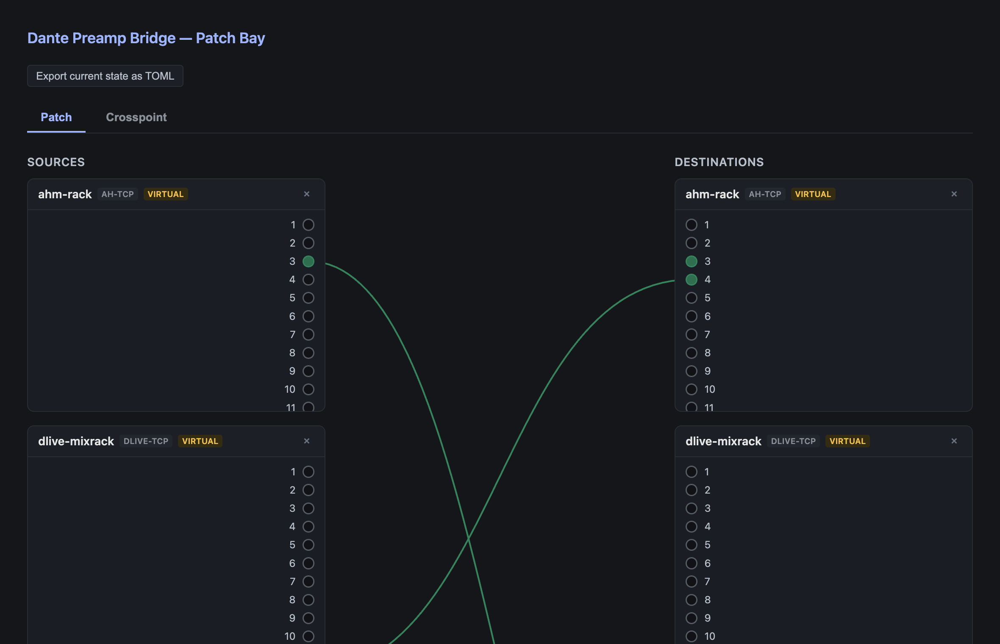

# Dante-BabelBox user guide

Dante-BabelBox is **a cross-vendor Dante control bridge**. Dante carries audio and basic device
discovery, but nothing about preamp gain, phantom power or wireless-mic status — each vendor
layers its own proprietary control protocol on top of the same network. This translates between
them, so state on one vendor's device is usable from outside its own ecosystem.

It covers two separate domains:

- **Preamp control** — bridging gain and phantom power across consoles and stageboxes from
  different vendors, with a patch-bay web UI.
- **Radio-mic telemetry** — battery, RF and audio level from wireless receivers, across vendors,
  **whether or not the hardware has a Dante audio option installed** — because the adapters only
  ever talk to a device's IP control channel and never touch Dante audio at all.

> **Before you rely on this:** adapters are built against official or community-authoritative
> vendor protocol specs, not guesswork, and are tested against mock devices. But **no adapter has
> been validated against real hardware**, and the **Lectrosonics mic adapter's wire format is an
> unverified placeholder** — a scaffold, not a working adapter.
>
> **One thing has been proven on hardware**, and it is worth knowing which: the Yamaha R-series HA
> protocol was captured from a real QL1 + Rio3224-D2, decoded, documented, rebuilt from that
> documentation and transmitted back — and the stagebox accepted it and changed its gain. That is
> a *protocol* proven on hardware, not *code*: the write came from a standalone script, and the
> Rio adapter is still unimplemented. See
> [yamaha-ha-remote-over-dante.md](yamaha-ha-remote-over-dante.md).
>
> This codebase was created with AI assistance, directed and reviewed by a human author.

---

## Which devices are supported

### Preamp control

| Vendor | Device | Protocol | Status |
|---|---|---|---|
| Behringer / Midas | X32, M32 | OSC | Done |
| Behringer | Wing | OSC | Done — **8 built-in preamps only** |
| Allen & Heath | AHM-series | NRPN over TCP | Done |
| Allen & Heath | dLive | NRPN over TCP (Socket addressing) | Done |
| Yamaha | DM3 / DM3S | OSC | Done |
| Allen & Heath | Qu, SQ | — | **Not implemented** — no public preamp-control spec exists |
| Yamaha | DM7, CL, QL | — | **Not implemented** — no public spec |
| Yamaha | Rio, Tio | Legacy AD8HR (MIDI SysEx) | **Not implemented** — setup docs exist, wire format doesn't |

### Radio-mic telemetry

| Vendor | Device | Protocol | Status |
|---|---|---|---|
| Shure | ULX-D | ASCII over TCP 2202 | Done |
| Shure | Axient Digital | ASCII over TCP 2202 | Wire framing done; field behaviour only spot-checked |
| Sennheiser | EW-DX EM 2 / EM 2 Dante / EM 4 Dante | SSC (JSON over UDP) | Done |
| Lectrosonics | DSQD / Duet | Ethernet control port | **Placeholder wire format — correct the bytes and the port before use** |

The Lectrosonics adapter keeps the project's no-fabrication rule for what it *reports* — audio
dBFS and RF dBm stay unset rather than being invented — but treat it as a scaffold until the wire
format is confirmed.

---

## Getting a bridge running

**1. See what is on the network.**

```sh
cargo run --bin preamp-bridge -- discover
```

This browses Dante's own mDNS advertisements. It tells you what is there; it does not tell you
what this bridge can drive.

**2. Generate a config.**

```sh
cargo run --bin preamp-bridge -- init --output bridge.toml
```

`init` discovers devices and probes each one against every implemented adapter's `identify()`
until one claims it. **Confidence varies by protocol, and it is worth knowing which you are
getting:**

- **X32-family and Wing** confirm vendor *and* model, from documented replies.
- **AHM and dLive** confirm the protocol family only — their specs have no model-string query.
- **DM3 is the weakest signal**: its spec documents no identify query at all, so a scene-status
  request is reused as a presence probe.

**`[[mapping]]` entries are not generated by default** — add them by hand, or see below.

**3. Run it.**

```sh
cargo run --bin preamp-bridge -- run --config bridge.toml
```

Editing `bridge.toml` while the bridge runs **hot-reloads the mapping table**.

---

## Inferring mappings from live Dante patching

```sh
cargo run --bin preamp-bridge -- init --output bridge.toml --infer-mappings
```

With this flag, `init` also queries each identified device's current Dante RX subscriptions and
writes a `[[mapping]]` for every subscription pointing at another device in the file. It is a real
signal — it comes from watching live patching, not from guessing.

> **One real caveat, and it is why this is opt-in.** The channel numbers it writes are **Dante
> audio channel numbers**. Whether those match the preamp/headamp channel a vendor adapter
> addresses is a *default-configuration convention* on most gear — Dante channel order mirrors
> physical I/O order 1:1 out of the box — **not a protocol guarantee**. A console with customised
> Dante patching breaks the assumption silently.
>
> Treat inferred mappings as a first draft to verify against each adapter's channel numbering.

---

## The patch-bay web UI

`run` also serves a web UI, bound by default to `0.0.0.0:8080` — reachable from any browser on the
LAN at `http://<this-machine's-IP>:8080`.



*A real screenshot of the running web UI. The devices shown are **virtual** placeholders, so the
UI can be demonstrated with no hardware on the network.*

- **Patch tab** — click a source channel, then a destination channel, to connect them; click a
  patch cable to disconnect.
- **Crosspoint tab** — the same mappings as a matrix, scoped to channels that are actually mapped.
  A full all-channels grid across even two devices would be tens of thousands of cells, so pin a
  device to bring all its channels into the grid on demand.
- **Device management** — add real devices (connects immediately) or **virtual** ones.
- **Export as TOML** — devices and mappings added through the UI are **in-memory only and do not
  survive a restart**. This button exports the current state so you can paste it into
  `bridge.toml` and keep it.

Change the bind with `--web-bind 127.0.0.1:8080` to restrict it to this machine, or turn it off
with `--no-web`.

> **There is no authentication and no TLS** — the same trust model as a hardware router's control
> port. It belongs on a trusted operations network, not the open internet.

### What "virtual" means

A virtual device is a placeholder for a **not-yet-built emulation layer**. Today the bridge is a
translating router you configure by IP and channel — genuinely useful, but not invisible to the
consoles. Making it answer as if it *is* a native device of a foreign brand, so a console's own
preamp UI drives it directly, needs packet captures of real gear paired with its own native
device, and none of that handshake is in any public spec.

Virtual devices let you design the intended topology now, before the emulation exists to back it.
If you can help with those captures, [`docs/`](.) has a non-technical field guide, one edition per
OS: [Windows](capture-guide-windows.md) · [macOS](capture-guide-macos.md) ·
[Linux](capture-guide-linux.md).

---

## The config file

```toml
[[device]]
id = "ahm-rack"
kind = "ah-tcp"        # osc-x32 | osc-wing | ah-tcp | dlive-tcp | yamaha-dm3
address = "10.0.0.10"
port = 51325           # optional — defaults to the protocol's standard port

[[device]]
id = "future-x32"
kind = "osc-x32"       # the protocol this virtual device will eventually emulate
virtual = true         # placeholder — no address needed
channels = 8

[[mapping]]
from = { device = "ahm-rack", channel = 3 }
to   = { device = "x32-monitors", channel = 7 }
bidirectional = true
```

> **`channel` means whatever the underlying protocol's native addressing unit is** — an X32
> headamp number, a dLive physical preamp **Socket** number (which is *not* the processing channel
> number), a DM3 Local Input number. This is the single most likely thing to get wrong. Check the
> relevant adapter's module doc comment for exact ranges.

`kind` is an open string, not a fixed list: a loaded plugin can register additional kinds. A fully
worked example is in [`bridge.example.toml`](../bridge.example.toml).

---

## Radio-mic telemetry

A separate binary, because the domain is a different shape — telemetry is read-heavy (battery, RF
and audio level are monitoring-only; mute is the only realistic write), so it has its own adapter
trait rather than extending the preamp router.

```sh
cargo run --bin mic-monitor -- discover
cargo run --bin mic-monitor -- watch
```

[mic-telemetry-architecture.md](mic-telemetry-architecture.md) diagrams both vendors' wire
protocols sequence by sequence, and exactly what ends up in the reported state per vendor.

---

## Adding a device the bridge doesn't support

Device support loads two ways, and both look identical to the router and the web UI. The one that
matters to you is **dynamic loading**: a plugin is a separate `.so`/`.dylib`/`.dll`, scanned from
`--plugins-dir` (default `plugins`) at startup.

**Adding a vendor needs no recompile of this project at all** — build your plugin, drop the file
in, restart the bridge. All five real preamp vendors already work this way.

[plugin-development-guide.md](plugin-development-guide.md) has the full contract, two worked
examples, and the real pitfalls hit while building it.

---

## Troubleshooting

| Symptom | Cause |
|---|---|
| **`discover` lists devices, `init` doesn't claim them** | Discovery is Dante's mDNS; identification is per-adapter. A device can be visible and unsupported. |
| **`init` identified a DM3 that isn't one** | DM3 has no identify query; a scene-status request stands in as a presence probe. It is the weakest signal of the five. |
| **Gain moves the wrong channel** | Channel numbering is per-protocol. On dLive especially, the Socket number is not the processing channel. |
| **Inferred mappings are off by a channel or scrambled** | The console has customised Dante patching, so Dante channel order no longer mirrors physical I/O. |
| **Devices added in the web UI vanished after a restart** | They are in-memory only. Use **Export as TOML** and keep it in `bridge.toml`. |
| **A command bounces back and forth between two devices** | Shouldn't happen — the router has echo suppression on bidirectional mappings. Worth reporting. |
| **Web UI unreachable from another machine** | `--web-bind` is set to loopback, or `--no-web` is on. |
| **Wing preamps above 8 don't respond** | Only the 8 built-in preamps are covered. |
| **Lectrosonics receiver reports nothing** | Expected — the wire format is an unverified placeholder. |

---

## See also

- [plugin-development-guide.md](plugin-development-guide.md) — adding a device without a PR
- [mic-telemetry-architecture.md](mic-telemetry-architecture.md) — the telemetry domain in full
- [yamaha-ha-remote-over-dante.md](yamaha-ha-remote-over-dante.md) — the protocol note proven
  against real hardware
- [API.md](API.md) · [DEVELOPING.md](DEVELOPING.md)
- Capture guides for helping build device emulation:
  [Windows](capture-guide-windows.md) · [macOS](capture-guide-macos.md) · [Linux](capture-guide-linux.md)
- [README](../README.md) — status tables, architecture and downloads
